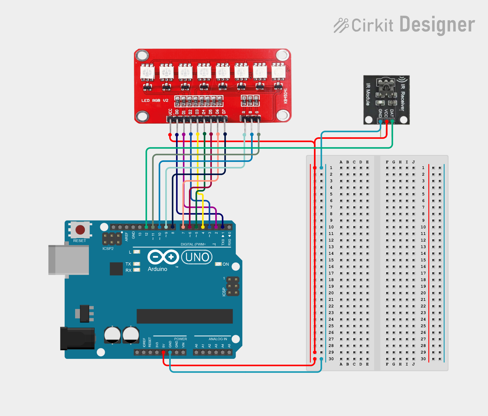
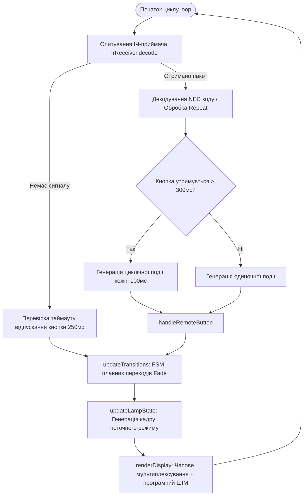

<div align="center">

# 🌟 Smart RGB Night Lamp on Arduino Uno
### Багатофункціональний світильник-нічник із часовим мультиплексуванням та ІЧ-керуванням

[-00979D?style=for-the-badge&logo=arduino&logoColor=white)](https://www.arduino.cc/)
[](https://en.cppreference.com/w/cpp)
[](#-архітектура-та-інженерні-рішення)
[](#-керування-з-іч-пульта)
[](LICENSE)

<p align="center">
  <b>Програмно-апаратний комплекс для розумного освітлення: 12 динамічних і статичних режимів, каліброване регулювання колірної температури (1000K–10000K), програмний 24-канальний ШІМ без мерехтіння та кінематографічні плавні переходи без використання блокуючих затримок.</b>
</p>

[Огляд](#-огляд-проєкту) •
[Ключові особливості](#-ключові-особливості) •
[Схема та апаратна частина](#-апаратна-частина-та-підключення) •
[Архітектура](#-архітектура-та-інженерні-рішення) •
[Режими роботи](#-режими-роботи-12-профілів) •
[Керування](#-керування-з-іч-пульта) •
[Швидкий старт](#-швидкий-старт)

---

</div>

## 📖 Огляд проєкту

**Smart RGB Night Lamp** — це вбудована система (embedded system) на базі мікроконтролера **ATmega328P (Arduino Uno)**, розроблена для точного керування 8-сегментним світлодіодним модулем **Keyes LED RGB v2**. 

Проєкт демонструє вирішення класичних інженерних викликів мікроконтролерної розробки:
1. **Дефіцит апаратних ШІМ-каналів**: замість зовнішніх драйверів реалізовано високочастотне часове мультиплексування матриці (8 катодів $\times$ 3 спільні аноди) із 24 програмними ШІМ-каналами.
2. **Максимізація використання GPIO**: лінію апаратного UART (`TX / Pin 1`) реконфігуровано у дискретний вихід для 1-го діода з повним вимкненням Serial-стека для усунення конфліктів шини.
3. **100% неблокуюча асинхронна модель**: обробка сигналів ІЧ-пульта, зміна кадрів анімацій та плавні переходи (Fade In / Fade Out) працюють на базі скінченного автомата (FSM) та таймерів `millis()`, гарантуючи миттєвий відгук без жодного виклику `delay()`.

---

## ✨ Ключові особливості

* 💡 **12 різноманітних режимів світіння**:
  * Каліброване біле світло (тепле 2000K, нейтральне 4000K, денне 6000K).
  * Плавне налаштування колірної температури у діапазоні **1000K – 10000K** з кроком 200K (46 ступенів за формулою інтерполяції спектра Планка).
  * Динамічні ефекти: *Bouncing Comet* (комета з інерційним хвостом та зміною відтінку при відбиванні), *Rainbow Wave* (хвиля веселки), *Color Cycle* (синхронне переливання) та *9-Color Breathing* (дихання).
  * Прямий інтерактивний ввід довільного 24-бітного кольору (`RRRGGGBBB`) з живим прев'ю на LED-стрічці.
* 🎬 **Кінематографічний Fade In / Fade Out**:
  * Плавне розгорання та згасання при увімкненні, вимкненні та зміні будь-якого режиму.
* 🎚 **Гнучке налаштування параметрів**:
  * **8 рівнів яскравості** з логарифмічно вирівняним сприйняттям (від 10% до 100%).
  * **20 швидкостей анімацій** завдяки оптимізованій таблиці затримок та кроків (`SpeedConfig`).
* 🎮 **Ергономічне ІЧ-керування (NEC Protocol)**:
  * Розпізнавання одиночних кліків (< 300 мс) та утримання кнопки (> 300 мс) для швидкого безперервного регулювання.
  * Пам'ять активного стану при вимкненні та увімкненні.

---

## 🛠 Апаратна частина та підключення

### Компоненти (BOM):
| Компонент | Кількість | Характеристики / Роль |
|---|:---:|---|
| **Arduino Uno R3** | 1 шт. | Мікроконтролер ATmega328P (16 МГц, 5V) |
| **Keyes LED RGB v2** | 1 шт. | Модуль на 8 RGB світлодіодів (спільний анод, активний `LOW`) |
| **ІЧ-приймач (VS1838B)** | 1 шт. | Несуча частота 38 кГц, кут огляду $\pm 45^\circ$ |
| **ІЧ-пульт дистанційного керування** | 1 шт. | 21 кнопка, протокол NEC |
| **З'єднувальні дроти** | комплект | Дроти типу Dupont (FF / FM) |

---

### 🔌 Розпіновка (Pinout Map)

#### 1. Модуль індикації Keyes LED RGB v2
Модуль побудований за топологією **спільного анода (Common Anode)**. Керування кольорами здійснюється через піни `R, G, B`, а активація конкретного діода — вибором катода `LED1..LED8`.

| Пін модуля | Пін Arduino Uno | Назва в коді | Призначення / Логічний рівень |
|---|:---:|---|---|
| **VCC** | **5V** | `5V Rail` | Живлення спільних анодів (+5В) |
| **R** | **Pin 9** | `pinR` | Канал червоного кольору (активний `LOW`) |
| **G** | **Pin 10** | `pinG` | Канал зеленого кольору (активний `LOW`) |
| **B** | **Pin 11** | `pinB` | Канал синього кольору (активний `LOW`) |
| **LED1** | **Pin 1 (TX)** | `ledPins[0]` | Вибір 1-го діода (*Serial UART вимкнено*) |
| **LED2** | **Pin 2** | `ledPins[1]` | Вибір 2-го діода |
| **LED3** | **Pin 3** | `ledPins[2]` | Вибір 3-го діода |
| **LED4** | **Pin 4** | `ledPins[3]` | Вибір 4-го діода |
| **LED5** | **Pin 5** | `ledPins[4]` | Вибір 5-го діода |
| **LED6** | **Pin 6** | `ledPins[5]` | Вибір 6-го діода |
| **LED7** | **Pin 7** | `ledPins[6]` | Вибір 7-го діода |
| **LED8** | **Pin 8** | `ledPins[7]` | Вибір 8-го діода |

> [!IMPORTANT]
> **Оптимізація виводів (Pin 1 / TX):** Пін 1 стандартно зарезервований під передавач апаратного UART. Оскільки для повноцінної роботи модуля потрібно 11 дискретних ліній, апаратний `Serial` у прошивці повністю деактивовано, а лінію реконфігуровано як загальний цифровий вихід (`OUTPUT`), що запобігає мимовільному підсвічуванню діода під час завантаження коду.

#### 2. Інфрачервоний приймач
| Пін приймача | Пін Arduino Uno | Опис |
|---|:---:|---|
| **DATA / OUT / S** | **Pin 12** | Сигнальний вхід переривання / демодулятора |
| **VCC / +** | **5V** | Живлення логіки приймача |
| **GND / -** | **GND** | Спільна земля схеми |

---

### 📐 Принципова схема підключення

<div align="center">
  
  <p><i>Рис. 1: Принципова схема з'єднання Arduino Uno, модуля Keyes LED RGB v2 та ІЧ-приймача.</i></p>
</div>

---

## 🧠 Архітектура та інженерні рішення

### 🔄 Потокова діаграма виконання (Dataflow & Control Loop)



### 1. Програмний ШІМ та часове мультиплексування (Time-Division Multiplexing)
Світлодіоди об'єднані в матрицю з спільними лініями кольорів:
* Функція `renderDisplay()` послідовно активує кожен з 8 світлодіодів, подаючи `LOW` на відповідний катодний пін.
* Протягом часу активації діода генерується програмний 255-ступеневий ШІМ-цикл для каналів `R`, `G` та `B`.
* Завдяки високій швидкості ітерації мікроконтролера частота оновлення значно перевищує критичну частоту злиття миготінь (CFF, >100 Гц), забезпечуючи абсолютно плавне та стабільне сприйняття світла людським оком.

### 2. Скінченний автомат переходів (Transition FSM)
Зміна режимів та вмикання/вимикання не викликають стрибків напруги чи різкої зміни кольору. Перехід керується станами:
* `TRANS_IDLE`: Стабільний робочий стан.
* `TRANS_FADE_IN` / `TRANS_FADE_OUT`: Плавне розгорання/згасання під час увімкнення та вимкнення пристрою кнопкою `OK`.
* `TRANS_MODE_OUT` $\rightarrow$ `TRANS_MODE_IN`: Двофазний плавний кросфейд між різними світловими режимами.

### 3. Модель розрахунку температури світла (Kelvin to RGB)
У режимі `#` виконується лінійна кускова інтерполяція кольору вздовж локусу Планка за 10 опорними точками від 1000K до 10000K:
```
1000K (Глибокий бурштин) ➔ 2700K (Тепла лампа) ➔ 4000K (Нейтральний білий) ➔ 6500K (Денний) ➔ 10000K (Холодний блакитний)
```

---

## 🌈 Режими роботи (12 профілів)

| Кнопка | Назва режиму | Тип | Технічний опис та візуальний ефект |
|:---:|---|:---:|---|
| **`1`** | **Нейтральне біле** | Статичний | Природне денне освітлення (~4000K), збалансоване для читання. |
| **`2`** | **Тепле біле** | Статичний | М'яке бурштинове затишне світло (~2000K) для вечірнього відпочинку. |
| **`3`** | **Холодне біле** | Статичний | Свіже біле світло з легким холодним відтінком (~6000K). |
| **`4`** | **Bouncing Comet** | Динамічний | Яскраве ядро комети здійснює коливальні рухи вздовж лінійки (0 $\leftrightarrow$ 7), залишаючи експоненційний слід та змінюючи колір при кожному ударі об край. |
| **`5`** | **Чистий Червоний** | Статичний | Монохромне червоне світло (RGB: `255, 0, 0`), ідеальне для збереження нічного зору. |
| **`6`** | **Чистий Зелений** | Статичний | Монохромний насичений смарагдовий колір (RGB: `0, 255, 0`). |
| **`7`** | **Чистий Синій** | Статичний | Глибокий сапфіровий колір (RGB: `0, 0, 255`). |
| **`8`** | **Rainbow Wave** | Динамічний | Неперервний хвильовий спектральний градієнт, що плавно біжить по всіх 8 діодах. |
| **`9`** | **Color Cycle** | Динамічний | Синхронне переливання всієї лінійки крізь повне спектральне коло кольорів (0..255). |
| **`0`** | **9-Color Breathing** | Динамічний | Плавне наростання та згасання 9 фіксованих кольорів поспіль (червоний, зелений, синій, фіолетовий, жовтий, ціан, рожевий, білий, помаранчевий). |
| **`*`** | **Custom RGB Input** | Інтерактивний | Прямий термінальний ввід RGB-значення з візуалізацією прогресу (деталі нижче). |
| **`#`** | **CCT Kelvin Tuner** | Аналоговий | Динамічне налаштування температури від **1000K** до **10000K** (46 кроків по 200K). |

---

### 🎨 Інтерактивний режим користувацького кольору `[*]`

Цей режим реалізує інтуїтивний інтерфейс введення через 21-кнопковий пульт без використання екрана:
1. **Курсор очікування (0 введених цифр)**: 1-й діод плавно пульсує теплим світлом, позначаючи готовність до вводу.
2. **Апаратний прогрес-бар (1..8 цифр)**: Кількість увімкнених діодів відповідає кількості введених цифр. Усі активні діоди в реальному часі відображають колір, який синтезується (`RRR -> GGG -> BBB`).
3. **Редагування помилок (Backspace)**: Натискання кнопки **`#`** видаляє останню цифру та зсуває прогрес-бар назад.
4. **Прев'ю завершення (9 цифр)**: Всі 8 діодів починають пульсувати повністю сформованим кольором.
5. **Фіксація**: Натисніть **`*`** або **`OK`** для збереження та переходу у статичне відображення кольору.

---

## 🎮 Керування з ІЧ-пульта

<div align="center">

```text
┌─────────────────────────┐
│       [ OK ]            │  ─── Увімкнення / Вимкнення (Fade In / Fade Out)
│   [▲] Яскравість +      │  ─── Збільшення яскравості (8 рівнів)
│   [▼] Яскравість -      │  ─── Зменшення яскравості (8 рівнів)
│   [◄] Швидкість / CCT - │  ─── Уповільнення анімації або тепліше світло
│   [►] Швидкість / CCT + │  ─── Прискорення анімації або холодніше світло
├─────────────────────────┤
│  [ 1 ]    [ 2 ]   [ 3 ] │  ─── 1: 4000K   │ 2: 2000K   │ 3: 6000K
│  [ 4 ]    [ 5 ]   [ 6 ] │  ─── 4: Комета  │ 5: Червоний│ 6: Зелений
│  [ 7 ]    [ 8 ]   [ 9 ] │  ─── 7: Синій   │ 8: Веселка │ 9: Спектр
│  [ * ]    [ 0 ]   [ # ] │  ─── *: RGB код │ 0: Дихання │ #: Kelvin 1000-10000K
└─────────────────────────┘
```

</div>

* **Коротке натискання (< 300 мс)**: Зміна значення на 1 дискретний крок.
* **Утримання (> 300 мс)**: Автоматичне плавне регулювання з кроком 100 мс (для яскравості, швидкості або температури).

---

## 🚀 Швидкий старт

### Вимоги:
* Встановлена **[Arduino IDE](https://www.arduino.cc/en/software)** (версія 1.8.x або 2.x).
* Бібліотека **[IRremote](https://github.com/Arduino-IRremote/Arduino-IRremote)** (версія 3.x або 4.x).

### Покрокова інструкція:
1. **Клонуйте репозиторій або завантажте файли проєкту:**
   ```bash
   git clone https://github.com/your-username/night_line_lamp.git
   cd night_line_lamp
   ```
2. **Встановіть залежність IRremote:**
   * Відкрийте Arduino IDE.
   * Перейдіть у `Sketch` $\rightarrow$ `Include Library` $\rightarrow$ `Manage Libraries...`.
   * Введіть у пошуку `IRremote` та натисніть **Install** (автор: *Armin Joachimsmeyer*).
3. **Підключення та прошивка:**
   * Підключіть компоненти згідно з [таблицею розпіновки](#-розпіновка-pinout-map).
   * Відкрийте файл `night_line_lamp.ino`.
   * Оберіть плату: `Tools` $\rightarrow$ `Board` $\rightarrow$ `Arduino AVR Boards` $\rightarrow$ **Arduino Uno**.
   * Оберіть відповідний COM-порт: `Tools` $\rightarrow$ `Port`.
   * Натисніть кнопку **Upload (Завантажити)**.

---

## 📂 Структура репозиторію

```text
night_line_lamp/
├── night_line_lamp.ino    # Вихідний C++ код прошивки (FSM, PWM, логіка анімацій)
├── circuit_image.png      # Електрична монтажна схема підключення компонентів
└── README.md              # Документація проєкту
```

---

## 📊 Технічні метрики коду

* **Мова**: C++ (Arduino Wiring)
* **Пам'ять Flash (ROM)**: $\approx 8.5\text{ KB}$ ($\approx 26\%$ від доступних 32 KB на ATmega328P)
* **Оперативна пам'ять (SRAM)**: $\approx 640\text{ B}$ ($\approx 31\%$ від доступних 2 KB)
* **Блокуючі виклики (`delay`)**: 0 (повністю неблокуючий цикл)
* **Частота оновлення кадру**: > 120 Гц (відсутність видимого мерехтіння)

---

## 📄 Ліцензія

Цей проєкт розповсюджується під вільною ліцензією [MIT](LICENSE). Ви можете вільно використовувати, модифікувати та поширювати даний вихідний код у некомерційних та комерційних цілях.
